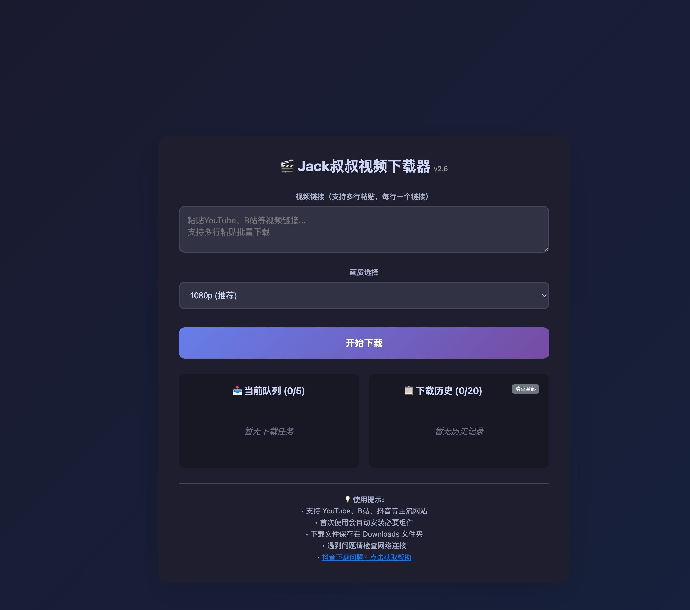

# 🎬 Jack叔叔视频下载器

一款极简的本地视频下载工具，Web 界面，基于 [yt-dlp](https://github.com/yt-dlp/yt-dlp)。

支持 YouTube、B站、抖音、小红书等 1000+ 网站。



## 功能

- 粘贴链接即下载，支持批量多链接
- 画质选择（8K/4K/1080p/720p）
- 下载队列管理 & 历史记录
- 实时进度条 & 下载速度显示
- 下载完成浏览器通知
- 暗色模式（跟随系统）
- 抖音 / 小红书专用下载支持
- yt-dlp 启动时自动更新

## 快速开始

### 环境要求

- Python 3.8+
- Node.js（yt-dlp 需要 JS runtime 解析 YouTube）

### 安装

```bash
# 克隆项目
git clone https://github.com/Jackjnz/videodowload.git
cd videodowload

# 安装依赖
pip install -r requirements.txt
```

### 启动

```bash
python3 ultra-simple-downloader.py
```

浏览器打开 `http://127.0.0.1:5001` 即可使用。

也可以用启动脚本：
- **macOS/Linux**: `./start.sh`
- **Windows**: 双击 `start.bat`

## 项目结构

```
├── ultra-simple-downloader.py  # 主程序（Flask + 内嵌前端）
├── base_helper.py              # 下载执行基础模块
├── douyin_helper.py            # 抖音下载助手
├── xiaohongshu_helper.py       # 小红书下载助手
├── url_converter.py            # URL 转换器（短链/分享链接解析）
├── requirements.txt            # Python 依赖
├── start.sh / start.bat        # 启动脚本
├── auto_install.py / .sh / .bat  # 自动安装脚本
└── VERSION.md                  # 更新日志
```

## 使用说明

1. 复制视频链接（支持分享链接、短链）
2. 粘贴到输入框（支持多行多链接）
3. 选择画质，点击下载
4. 文件保存到 `~/Downloads`

## 注意事项

- YouTube 下载需要浏览器 Cookie（程序自动从 Chrome/Safari 提取）
- 抖音下载需要先在设置中提取 Cookie
- 仅供个人学习使用，请遵守相关法律法规

## License

MIT
